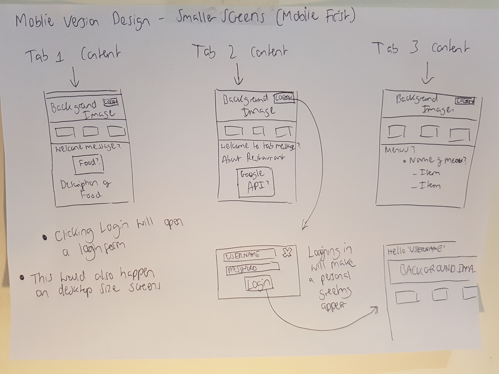
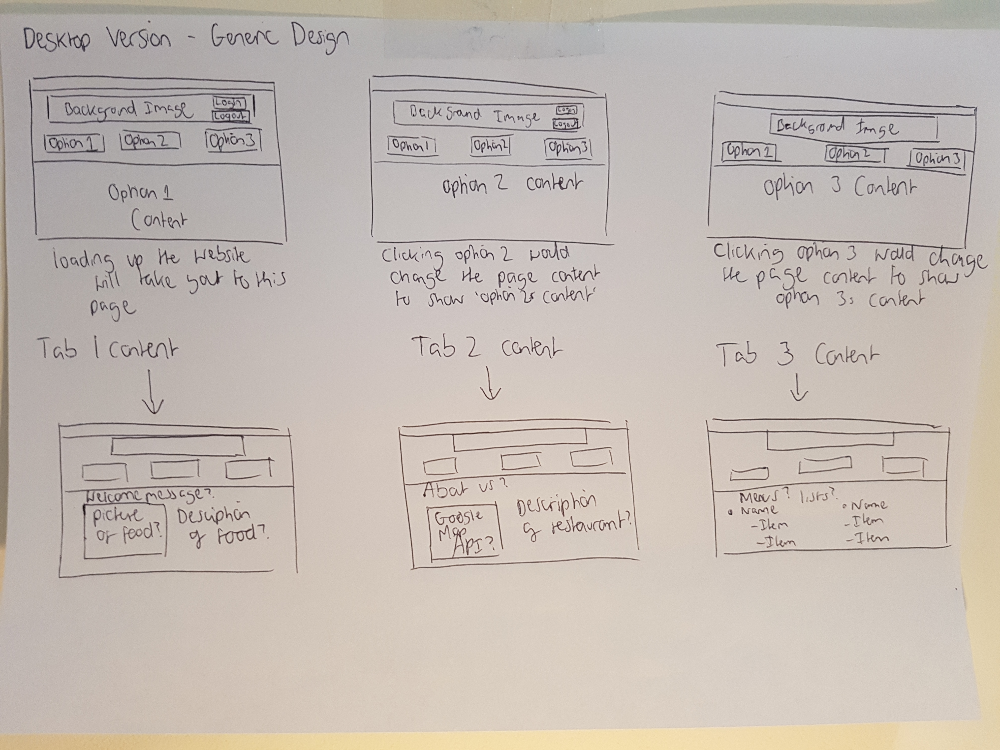

# WebsiteCoursework - DMU Restaurant

## About the Website
This website is for a restaurant located on site at DMU university. Located at the very top of the page in the header of the webpage, there is a JavaScript greeting. The greeting changes depending on what time of day the user visits the website. It has a universal banner located at the top of the website that uses a section element as an image container. It also contains a h1 element that acts as a website title.  

The website has a login button located in the banner. Pressing this button causes a login form pops up. The website has basic built in validation for the username. If the user leaves the username field of the form blank, it will cause an alert notifying the user that they must enter a valid username.  

Once the user has successfully 'logged in' the website uses JavaScript cookies to display the username in the header element. 

The website has three 'webpages' embedded into one single page application. When the webpage is loaded it automatically shows the first tab and its content. The first tab is a welcome tab that shows pictures of food the restaurant serves using a JavaScript slideshow that scrolls through three images. Each image also has a caption to go with it.  

The 2nd tab is an 'About us' tab that has some basic information about the restaurant. It has an embedded Google Map API that shows exactly where the restaurant is (The map is meant to have a red pin to show the location on the map. However, the red pin doesn't always appear.) 

The 3rd tab is a Menu tab that displays a few different lists with different items. These lists act as restaurant menus. 

## Problems and Issues I faced

## Initial Designs and designing the website
The reason I have designed the website in this way is due to the fact I believe it provides simple and yet effective navigation. Another reason I chose this design is because a single page application has faster loading times than regular multi page websites.  

A lot of the elements within the website contain a 'hover' attribute and turn a different colour when the user is hovering over the option. This hover feature helps the users to locate where their cursor is and adds to the user friendliness of the website. 

The website is completely responsive and is designed to fit mobile first. The website uses six breakpoints to constantly adjust the sizes of elements to fit to screen.

